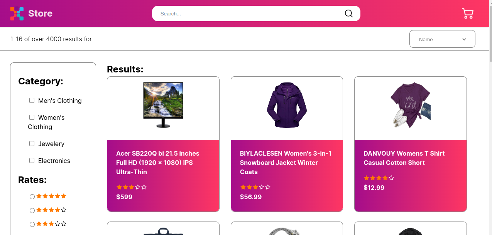

# E-commerce

> This app is and e-commerce where you can add items to the cart, sort items by different categories and see a short description of every item. I was built with React and JavaScript.

<p align="center">

 
## Live Demo

[E-commerce](https://e-commerce-project-santiago.netlify.app/)

## Built With

- React, JavaScript 

## Setup Project
Open your favourite terminal in the root and install the npm dependencies with:

```npm install```

Then run the following command to run the project on the local server:

```npm run dev```

You can also check the lint by running:

```npm run lint```


## Author

👤 **Santiago Cárdenas**

- GitHub: [@Santiago Cárdenas](https://github.com/Santiago220991)
- LinkedIn: [Santiago Cárdenas](https://www.linkedin.com/in/alexandersantiagocardenas/)

---

## 🤝 Contributing

Contributions, issues, and feature requests are welcome!

Feel free to check the [issues page](https://github.com/Santiago220991/E-COMMERCE/issues).
